# Architecture Diagrams

This document provides visual representations of the Agent Directory architecture using Mermaid diagrams.

## Schema Inheritance Chain

The msDS-Agent class inherits from User for identity. The msDS-AgentSandbox class inherits from Computer for execution environments.

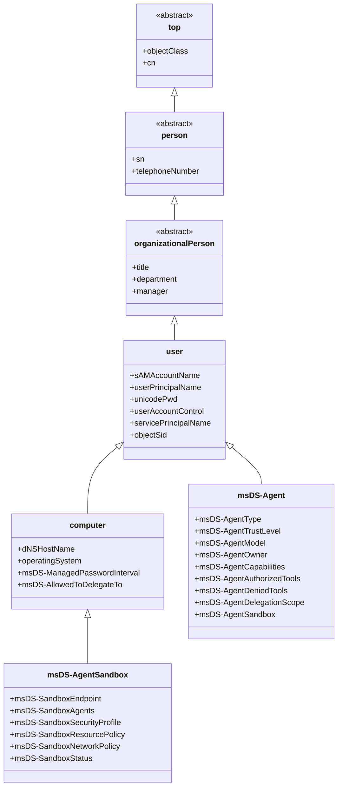

## Object Relationships

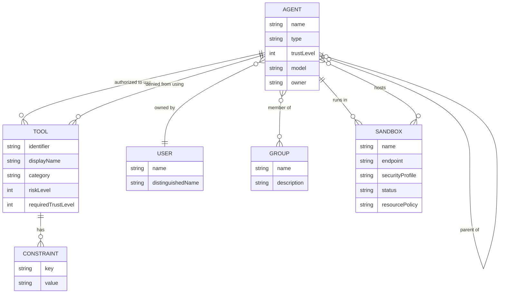

## Authentication Flow

### Kerberos Authentication

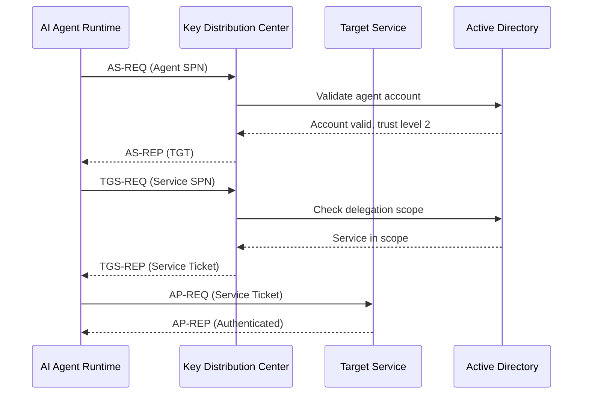

### Certificate Authentication

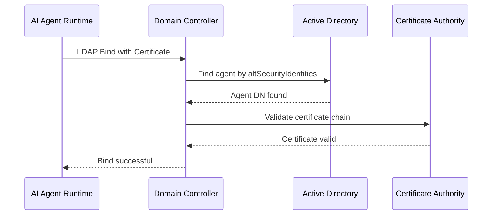

### Constrained Delegation (S4U)

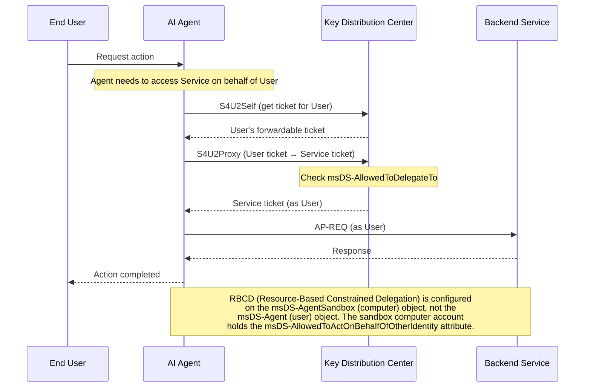

## Tool Authorization Flow

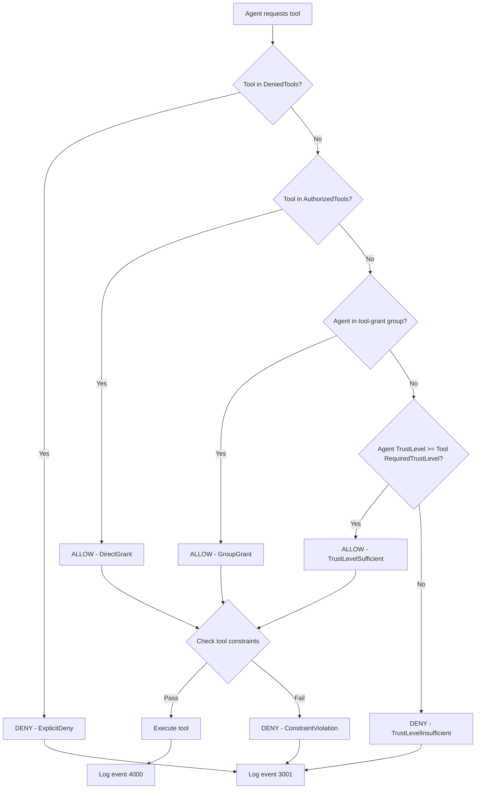

## Event Logging Architecture

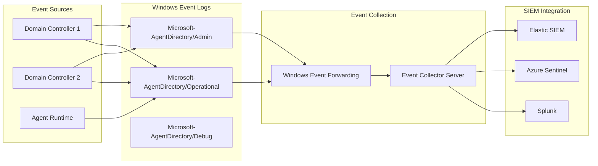

## Trust Level Hierarchy

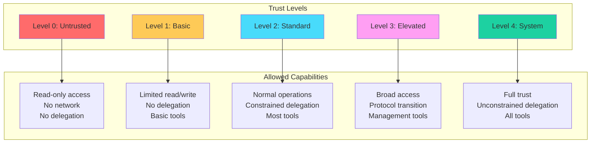

## Container Structure

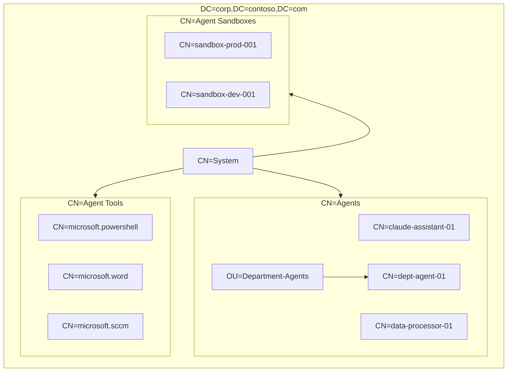

## Deployment Architecture

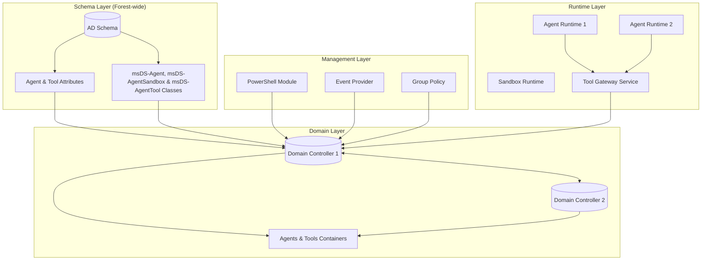

## Component Interaction

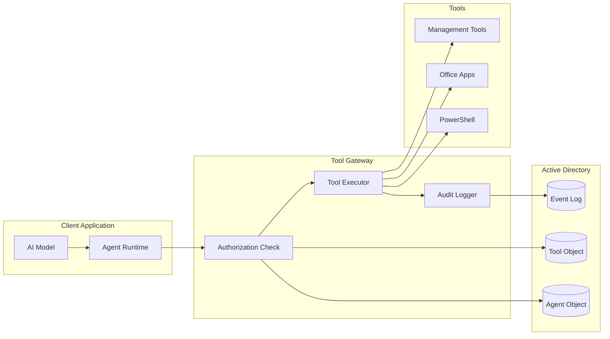

## Security Boundaries

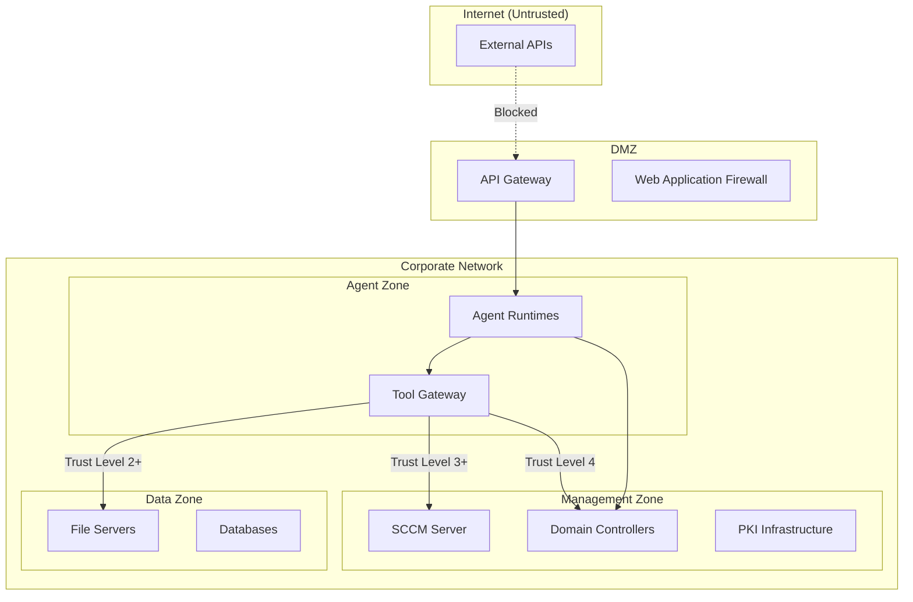

## Viewing These Diagrams

These diagrams are written in [Mermaid](https://mermaid.js.org/) syntax. To view them:

1. **GitHub/GitLab**: These platforms render Mermaid diagrams natively in markdown files
2. **VS Code**: Install the "Markdown Preview Mermaid Support" extension
3. **Online**: Use the [Mermaid Live Editor](https://mermaid.live/)
4. **Documentation**: Export to PNG/SVG using Mermaid CLI: `mmdc -i ARCHITECTURE.md -o diagrams/`
